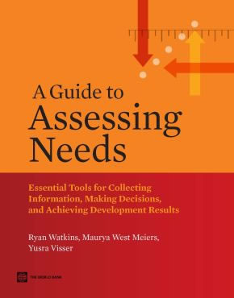

::: {.guide-hero}
{fig-alt="Cover of A Guide to Assessing Needs"}

# A Guide to Assessing Needs

**A free guide book and practical toolkit for collecting information, making decisions, and achieving development results.**

[Read or download the complete book from the World Bank Knowledge Repository](https://openknowledge.worldbank.org/handle/10986/2231){.btn .btn-primary}
:::

The earliest decisions that lead to development projects are among the most critical in determining long-term success. This guide helps turn ideas into project proposals and supports the decisions that shape later actions and results.

Needs assessments support that early phase with practical approaches for gathering information and making justifiable decisions. The guide covers both large-scale formal needs assessments and less-formal assessments that guide daily decisions. Its tools can help you conduct focus groups, develop surveys, prioritize needs, and lead group decision-making.

## Downloadable chapters and tools

The chapter and tool links below point to `guide-files/` in this GitHub repository. Upload the files using the listed names and the links will work automatically.

### Core sections

- [Section 1. Needs Assessment: Frequently Asked Questions](guide-files/Section-1.pdf)
- [Section 2. Needs Assessment: Steps to Success](guide-files/Section-2.pdf)

### Part 3A. Data collection tools and techniques

- [Part 3A. Data Collection Tools and Techniques](guide-files/Section-3A.pdf)
- [Document or Data Review](guide-files/Document-and-data-review.pdf)
- [Guided Expert Reviews](guide-files/Guided-expert-reviews.pdf)
- [Management of Focus Groups](guide-files/Focus-groups.pdf)
- [Interviews](guide-files/Interviews.pdf)
- [Dual-Response Surveys](guide-files/Dual response-surveys.pdf)
- [SWOT+](guide-files/SWOT+.pdf)
- [World Café™ (with “Speed Dating” Variation)](guide-files/World-Cafe.pdf)
- [Delphi Technique](guide-files/Delphi-technique.pdf)
- [Performance Observations](guide-files/Performance-observations.pdf)
- [Task Analysis (Hierarchical or Sequential, If-Then, and Model-Based)](guide-files/Task-analysis.pdf)
- [Cognitive Task Analysis](guide-files/Cognitive-task-analysis.pdf)

### Part 3B. Decision-making tools and techniques

- [Part 3B. Decision-Making Tools and Techniques](guide-files/Section-3B.pdf)
- [Nominal Group Technique](guide-files/Nominal-group.pdf)
- [Multicriteria Analysis](guide-files/Multicriteria-analysis.pdf)
- [Tabletop Analysis](guide-files/Tabletop-analysis.pdf)
- [Pair-Wise Comparison](guide-files/Pair-wise-comparison.pdf)
- [2 × 2 Matrix Decision Aids](guide-files/2x2-matrix-decision-aids.pdf)
- [Fishbone Diagrams](guide-files/Fishbone.pdf)
- [Scenarios](guide-files/Scenarios.pdf)
- [Root Cause Analysis](guide-files/Root-cause-analysis.pdf)
- [Fault Tree Analysis](guide-files/Fault-tree-analysis.pdf)
- [Concept Mapping](guide-files/Concept-mapping.pdf)
- [Future Wheel](guide-files/Future-wheel.pdf)
- [Performance Pyramid](guide-files/Performance-pyramid.pdf)

### Appendix A. Management and implementation guides and checklists

- [A.1. Implementation Plan for a Needs Assessment](guide-files/Implementation-plan-Appendix-A1.pdf)
- [A.2. Detailed Checklist for Needs Assessment Management Activities](guide-files/Detailed-checklist-Appendix-A2.pdf)
- [A.3. A Six-Week Needs Assessment Implementation Guide](guide-files/Six-week-guide-Appendix-A3.pdf)
- [A.4. Tools and Techniques to Consider](guide-files/Tools-to-consider-Appendix-A4.pdf)
- [A.5. Guide to Selecting Tools and Techniques (Applied Multicriteria Analysis)](guide-files/Guide-to-selecting-Appendix-A5.pdf)
- [A.6. Three-Phase Needs Assessment Process with Additional Details](guide-files/Three-phase-with-details-Appendix-A6.pdf)
